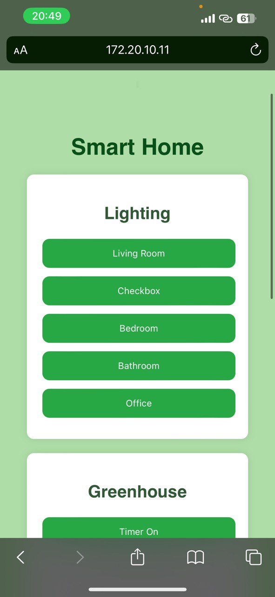

# SmartHome Project

## Overview

SmartHome is a comprehensive IoT-based home automation system that integrates hardware, AI, and a user-friendly web interface to provide seamless control over home devices. The project is structured to include components for data processing, machine learning, a backend for database management, and a frontend for user interaction.

## Project Structure

```
.
├── nlp
│   ├── AI.ipynb            # Notebook for AI model training and testing
│   ├── data.txt            # Sample dataset for AI
│   └── svm_model.pkl       # Serialized machine learning model
├── arduino
│   └── code.ino  # Arduino code for hardware control
├── backend
│   ├── database.py         # Database interaction logic
│   ├── data.txt            # Backend data file (update this path with your file location)
│   ├── main.py             # Main program file to run the application
│   ├── model.h5            # Trained AI model
│   └── __pycache__         # Compiled Python files
├── database
│   └── smart_home.db       # SQLite database for storing user and device data
├── frontend
│   ├── static
│   │   ├── styles.css      # CSS for frontend styling
│   └── templates
│       ├── control.html    # Control panel for device management
│       ├── login.html      # Login page for user authentication
│       └── register.html   # User registration page
```

## Features

- **Hardware Control:** Interface with Arduino to manage home devices.
- **AI Integration:** Machine learning for predictive automation.
- **Database Management:** Stores user information and device states using SQLite.
- **Web Interface:** Intuitive frontend for controlling devices and managing accounts.

## Project Images

Below are some images used in the project:



## Installation

1. Clone the repository:

   ```bash
   git clone https://github.com/amin-Lotfi/SmartHome.git
   ```

2. Navigate to the project directory:

   ```bash
   cd smart_home_project
   ```

3. Install backend dependencies:

   ```bash
   pip install -r requirements.txt
   ```

   Ensure the following Python libraries are included in the `requirements.txt` file:

   - fastapi
   - uvicorn
   - serial
   - pydantic
   - scikit-learn
   - hazm
   - nltk

   Additionally, install NLTK datasets:

   ```bash
   python -m nltk.downloader punkt
   ```

4. Upload the Arduino code:

   - Open `arduino/smart_home/smart_home.ino` in the Arduino IDE.
   - Connect your Arduino device and upload the code.

## Usage

1. Start the backend server:

   ```bash
   python backend/main.py
   ```

   Make sure to update the path to the `data.txt` file in the code if it's not located at:

   ```
   /home/amin/Documents/project rostami/smart_home_project/backend/data.txt
   ```

2. Open a browser and navigate to `http://localhost:5000`.

3. Use the web interface to log in, register, and control your devices.

## Requirements

- Python 3.10 or later
- Flask
- FastAPI
- SQLite
- Arduino IDE
- Required Python libraries (listed in `requirements.txt`)

## Contributing

Contributions are welcome! Please fork the repository and submit a pull request for review.

Feel free to contact [aminlotfi.ogl@gmail.com](mailto\:aminlotfi.ogl@gmail.com) for questions or feedback.

